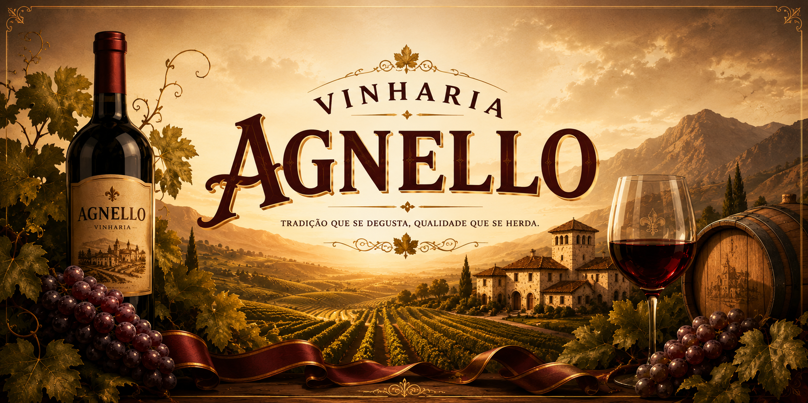

  

  

<h1 align="center">
🍷 Vinheria Agnello
</h1>

<h2 align="center">
🍇 Sistema Individual com Objetos, Arrays e Funções de Alta Ordem
</h2>

---

## 📖 Descrição do Projeto

Este projeto foi desenvolvido para o **Check-Point 03** da disciplina de Web Development, com o objetivo de aplicar conceitos fundamentais de JavaScript em um sistema de gerenciamento de vinhos da **Vinheria Agnello**.

Nesta etapa, o sistema trabalha com um catálogo de vinhos representado por um **array de objetos**, onde cada vinho possui informações como nome, tipo, safra e quantidade em estoque.

A aplicação realiza análises automáticas utilizando funções de alta ordem, como `forEach()`, `filter()`, `reduce()` e `map()`, exibindo os resultados por meio de `console.log()` e `alert()`.

---

## 🎯 Objetivo

Aplicar os conhecimentos de JavaScript estudados em aula, com foco em:

- Manipulação de **objetos**;
- Manipulação de **arrays**;
- Uso de **funções reutilizáveis**;
- Aplicação de **funções de alta ordem**;
- Exibição de informações com `console.log()` e `alert()`;
- Organização clara e estruturada do código.

## 🚀 Funcionalidades Implementadas - CP3

- Criação de um array de objetos representando os vinhos da vinícola;
- Cada vinho possui:
  - Nome;
  - Tipo;
  - Safra;
  - Estoque.
- Função para adicionar novos vinhos ao array;
- Listagem completa dos vinhos utilizando `forEach()`;
- Filtragem dos vinhos com estoque abaixo de 5 unidades utilizando `filter()`;
- Cálculo do estoque total da vinícola utilizando `reduce()`;
- Exibição dos nomes dos vinhos em caixa alta utilizando `map()`;
- Exibição dos resultados no console do navegador;
- Exibição de mensagens informativas usando `alert()`;
- Página HTML simples com apresentação do sistema;
- Estilização personalizada com CSS;
- Código JavaScript organizado em funções reutilizáveis.

## 🛠️ Tecnologias Utilizadas

## 🔗 Acesso ao Projeto
- [Repositório Github](https://github.com/dev-fgustavot/vinheria-agnello-CP3-Web)
- [Github Pages](https://dev-fgustavot.github.io/vinheria-agnello-CP3-Web/) 

---

## 👤 Aluno

| Nomes         | RM             |
| :-------------| :------------: |
| Gustavo Ferreira Tavares | 569928 |

---

*"Gerenciando vinhos com lógica, organização e boas práticas em JavaScript."*

